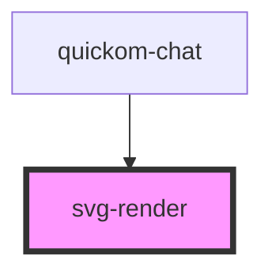

# svg-render

<!-- Auto Generated Below -->

## Properties

| Property | Attribute | Description | Type     | Default     |
| -------- | --------- | ----------- | -------- | ----------- |
| `height` | `height`  |             | `number` | `0`         |
| `src`    | `src`     |             | `string` | `undefined` |
| `width`  | `width`   |             | `number` | `0`         |

## Dependencies

### Used by

 - [quickom-chat](../quickom-chat)

### Graph

----------------------------------------------

*Built with [StencilJS](https://stenciljs.com/)*
